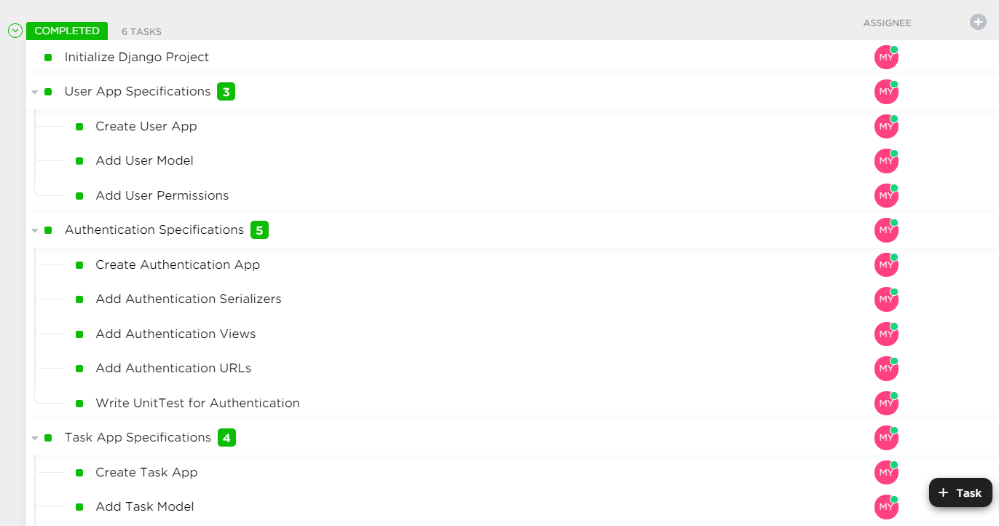
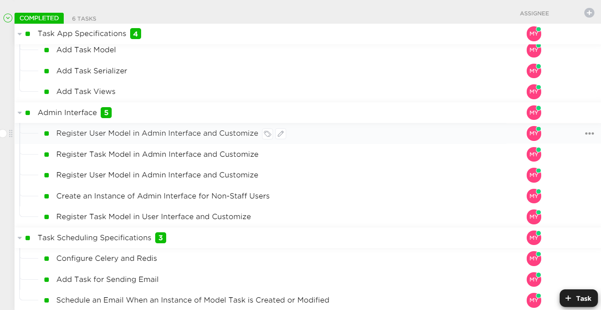

# In the name of GOD
##Description
This projects is a simple task scheduling project in which there are two types
of users namely, 'normal' and 'admin'. Users have these fields:
- username
- password
- first_name
- last_name
- email
- and a set of permissions

Normal users can add and view their own tasks which have:
- title
- description
- owner
- time_to_send

while admins not only can edit and view and add to normal users' tasks, but
they also can manage the normal users themselves.

There are sign up and login APIs through which users can sign up and access
their account. Superusers can also use the sign up API to add new users or 
admins.

I've decided that admins can't add other admins and change permissions
groups, but it's easily modifiable. The permissions which are set for users
upon creation are also easily modifiable through set_permission method
in User model.

When creating tasks, the time_to_send field is used to schedule an email
on that time to the user.

## Tasks
you can see the list of tasks that I specified for myself in the pictures below.



## Django Admin
For the django admin interface to be used by both normal and admin users
I needed to create 2 different instances of AdminSite since normal users
can't access the admin interface because they're not staff members.
So there are 2 URLs, one for admins(/admin) and one for normal users
(/user) which are both customized to meet the specifications pointed out
in the document.

## Authentication
Authentication is implemented by django simple_jwt module and both of
login(token obtain) and refresh token are tested using django TestCase.
To run the tests you can use the following command in the root of the project.
```
python manage.py test
```

## Run
To run the project you have to open your terminal in the root of the
project next to manage.py.

Then install the requirements:
```
pip install -r requirements.txt
```
After that migrate the database migrations:
```
python manage.py migrate
```
Then run the server on your localhost with the command below:
```
python manage.py runserver
```
and you can access the APIs or the interfaces with their URLs.
APIs are documented in the postman collection, you just need to 
add authorization token in the header where needed. Interfaces are
also easy to follow and self-explanatory.
For email scheduling you need to install and run redis.After that
you have to enter values for celery and email backend configs in 
settings.py of the project and also run the celery worker with the
command below:
```
celery -A Scheduler worker -l info
```

## Conclusion
I hardly tried to follow the specifications of the challenge document
and tried to create a clean and easily modifiable project. Don't
to contact me and ask for a presentation on how I managed to developed
the project and ask any questions that might have occurred to you.