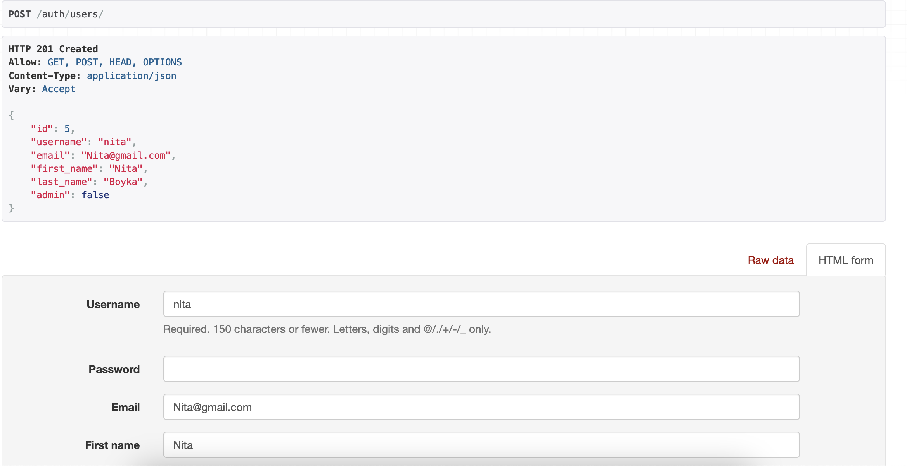
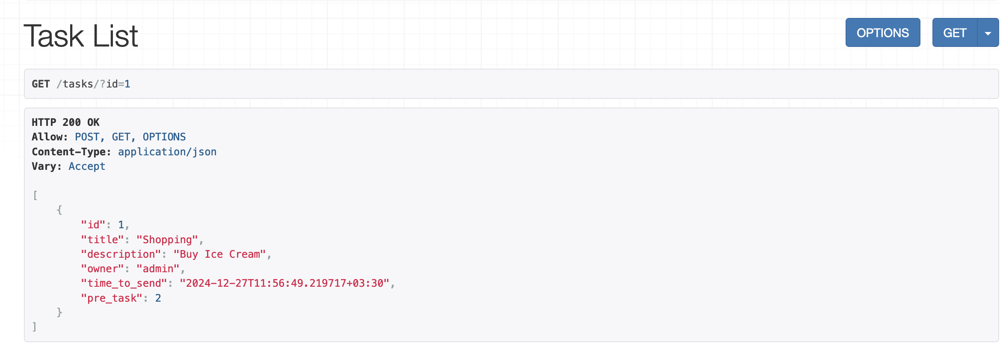

## RESTful API using DRF

### User Class has extended

 

# Features
1. using JWT for authenticaton
2. all endpoints protected by defaul(need to authenticate first)
3. using celery to handle email sending(when ever user send a get request to task_status endpoint, he can check his done tasks)

## Sample
### Get Task List:
if user is a superuse (admin), he can check all tasks here
if he/she is just a normal user with limited permissions, he just can check his own tasks.

 

### Get Task for an authenticated normal user:

 

### POST a task:

 

### Check Task Status:
if you visit this endpoint and any of your task is done, this will show you those tasks and sending those tasks to your email aswell.

 

### Register User:
#### fields to fill:
1. username
2. password
3. email
4. firstname
5. lastname

 

### Delete a user:
auth/users/2
Admin users can delete users, Normal users can delete own's profile aswell.

 

### Create a Jason-Web-Token (access & refresh tokens):
auth/jwt/create
First You need to create a user, then you just kinda log in in this endpoint and get your tokens

 

### Delete a protected task:
if you want to delete a task that associated with another task as pretasks of that task, then you can't delete that task

 

### Delete a unprotected task:
it means there is no dependeny on this task

 

### Searching tasks by title:
tasks/?title=SOMETHING

 

### Searching tasks by id:
tasks/?id=1

 

### Updating task:
tasks/2

 

### Users List:
If you are an admin, you can see all users data here
if you are a normal user, you just see your account details here

 

### User Endpoint:
To check your profile data and edit that
auth/users/me
 
 

## Definiton

We just have a single model.Task class
owner is a foreignkey to User model(User model Extended and customized and refrenced from core app)
pre_task field is also a foreignkey to itself(Task --> 'self')

API view used to decorate function-based views
we didnt use router for limited time(firsly code written in function-based)

we just have a Single Serializer to handle serializion and deserialization of Task Object

### urls are also like this:

127.0.0.1:8000/tasks
127.0.0.1:8000/tasks/{task_id}
127.0.0.1:8000/tasks/task_status
127.0.0.1:8000/auth/users
127.0.0.1:8000/auth/users/me
127.0.0.1:8000/auth/users/{user_id}/me
127.0.0.1:8000/auth/jwt/create
127.0.0.1:8000/auth/jwt/refresh