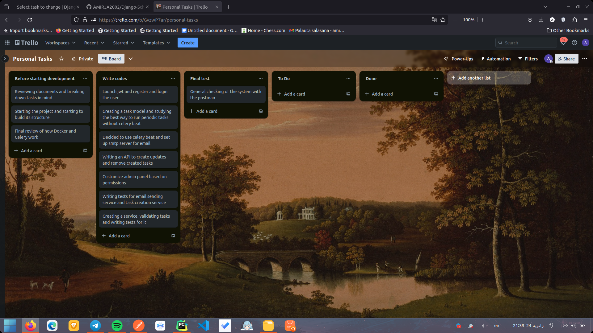

# schedular

## project setup

```
cd schedular
```

1- create your env
```
cp .env.example .env
```

2- spin off docker compose
```
docker compose -f docker-compose.yml up -d
```

3- To see the documentation, see the link below
```
127.0.0.1:8000/
```

## Road map of development


1- Step one 
##
In the beginning, I decided to spend some time thinking about the task and write down the steps I need to take on paper. After that, I decided to break down the development process into three sections.

First, to set up the complete project structure so that I won't have to deal with it later. After that, write the code. In the final stage, for peace of mind, thoroughly test them.

Thanks to Cookie Cutter for speeding up my work
##

2- Step two 
##
I have decided to use a structure that I personally prefer for my project, which is clean structure. In this structure, select queries are written inside selectors, and services are written within the service section. Serializers only handle serialization and validation tasks, so I think it's better to write them inside views for better accessibility, knowing the inputs and outputs of our code.

To start development, I implemented authentication and then moved on to implementing tasks. The most challenging part for me was how to execute tasks without Celery. In the end, I decided to create a Celery job for task serialization, and this job is created in the initial system run.

After that, I implemented the logic for executing tasks and sending emails. I had previously encountered issues with email sending during unit testing, so this time I tried to resolve it.

And a CRUD operation for the task model that was not very challenging

Then, I customized the admin panel for use by regular users and personal admin users, thanks to Django admin capabilities.

After finishing the admin panel work, I wrote tests for the services I had implemented so far. Finally, I developed an algorithm to validate whether multiple related tasks should be executed together or not.
##

3- Step three
##
In the end, I tested the functionality of the application with my post and Swagger to make sure
## 
